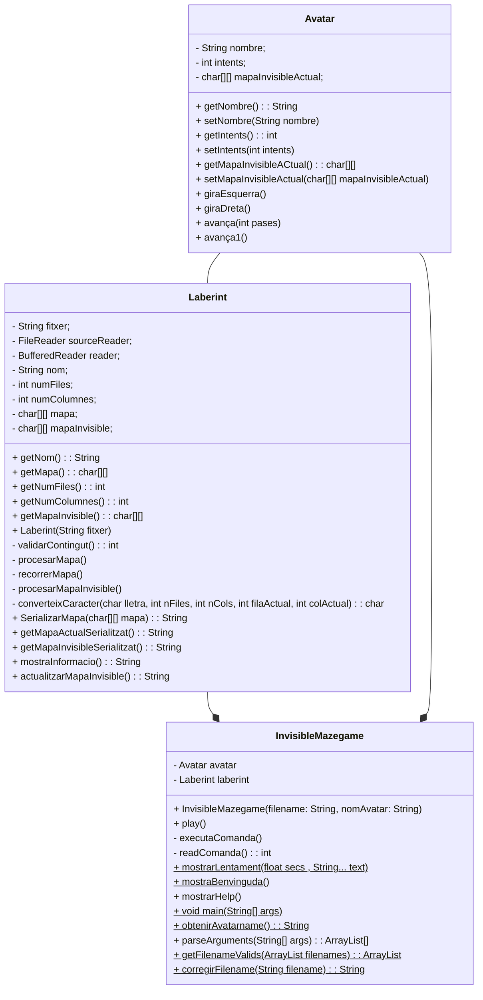

```mermaid

classDiagram
    class InvisibleMazegame {
        - Avatar avatar
        - Laberint laberint
        + InvisibleMazegame(filename: String, nomAvatar: String )

        + play()
        - executaComanda()
        - readComanda(): int

        + mostrarLentament(float secs , String... text)$
        + mostraBenvinguda()$
        + mostrarHelp()
        + void main(String[] args)$
        + obtenirAvatarname()$: String 
        + parseArguments(String[] args): ArrayList<String>[]
        + getFilenameValids(ArrayList<String> filenames)$: ArrayList<String>
        + corregirFilename(String filename)$: String

    }

    class Avatar {
        - String nombre;
        - int intents;
        - char[][] mapaInvisibleActual;
        + getNombre(): String
        + setNombre(String nombre)
        + getIntents(): int
        + setIntents(int intents)
        + getMapaInvisibleACtual(): char[][]
        + setMapaInvisibleActual(char[][] mapaInvisibleActual)
        + giraEsquerra()
        + giraDreta()
        + avança(int pases)
        + avança1()
    }

    class Laberint {
        - String fitxer;
        - FileReader sourceReader;
        - BufferedReader reader;
        - String nom;
        - int numFiles;
        - int numColumnes;
        - char[][] mapa;
        - char[][] mapaInvisible;
        + getNom(): String
        + getMapa(): char[][]
        + getNumFiles(): int
        + getNumColumnes(): int
        + getMapaInvisible(): char[][]

        + Laberint(String fitxer)
        - validarContingut(): int
        - procesarMapa()
        - recorrerMapa()
        - procesarMapaInvisible()
        - converteixCaracter(char lletra, int nFiles, int nCols, int filaActual, int colActual): char
        + SerializarMapa(char[][] mapa): String
        + getMapaActualSerialitzat(): String
        + getMapaInvisibleSerialitzat(): String

        + mostraInformacio(): String
        + actualitzarMapaInvisible(): String

    }

    


    
    Laberint --* InvisibleMazegame
    Avatar -- Laberint
    Avatar --* InvisibleMazegame

```
